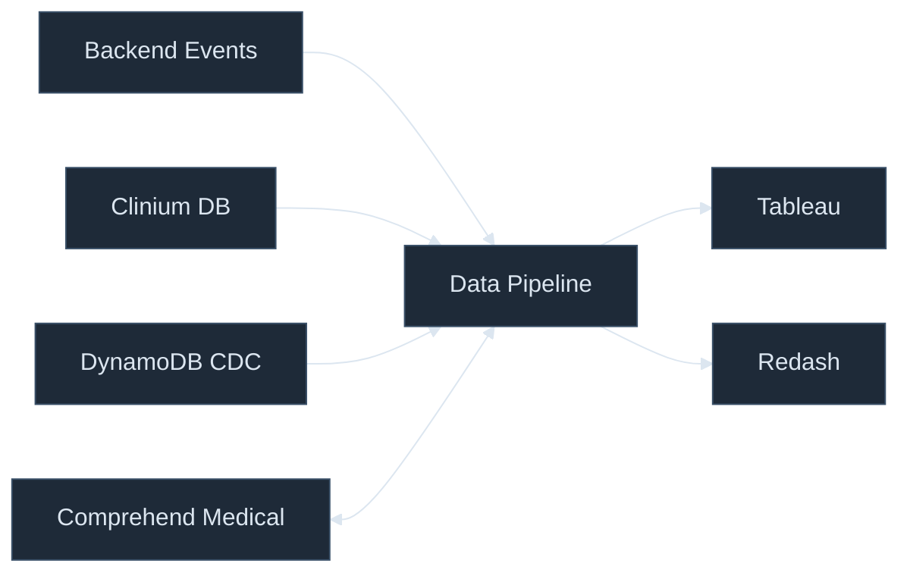

# Context Viewpoint

---
layout: default
---

## Context Diagram

```mermaid
%%{init: {
  'theme': 'base',
  'themeVariables': {
    'background': '#0B0F14',
    'primaryColor': '#1e2a38',
    'primaryBorderColor': '#3a5068',
    'primaryTextColor': '#dce6f0',
    'lineColor': '#dce6f0',
    'edgeColor': '#7ab8e0'
  }
}}%%
graph LR
    BE["Backend Events"]
    CL["Clinium DB"]
    DDB["DynamoDB CDC"]
    CM["Comprehend Medical"]
    Platform["Data Pipeline"]
    Tableau
    Redash

    BE --> Platform
    CL --> Platform
    DDB --> Platform
    CM <--> Platform
    Platform --> Tableau
    Platform --> Redash
```

