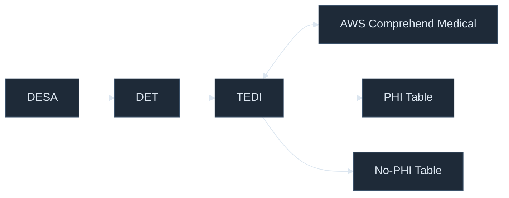
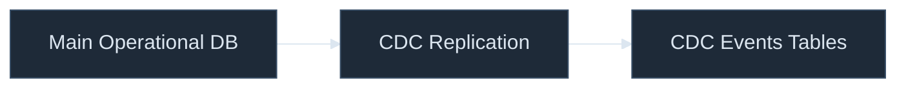
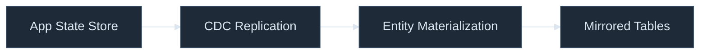
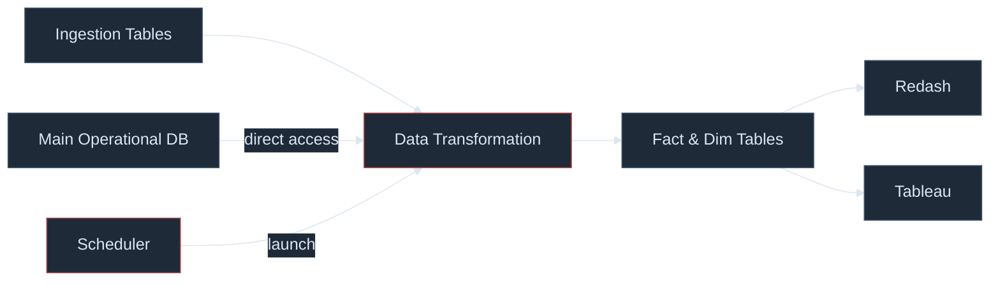
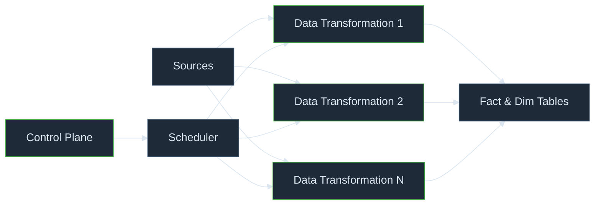

# Functional Viewpoint

---
layout: default
---

## Backend Event Ingestion

* DESA - Listen to RabbitMQ
* DET - Events Transformation (normalizes different versions)
* TEDI - Text De-identification

---
layout: default
---

## CDC Ingestion

**Postgres CDC**

**DynamoDB CDC**

* Entity Materialization - Calculate latest version

---
layout: default
---

## Transformation - Current

* The scheduler runs all dbt models on every run
* The transformation evolved into a monolith
* Resulting in unnecessary compute and operational complexity.

---
layout: default
---

## Transformation - Solution

* Automatically manage dependencies
* Trigger execution based on data updates and schedules
* Break the monolithic transformation into modular pipelines

