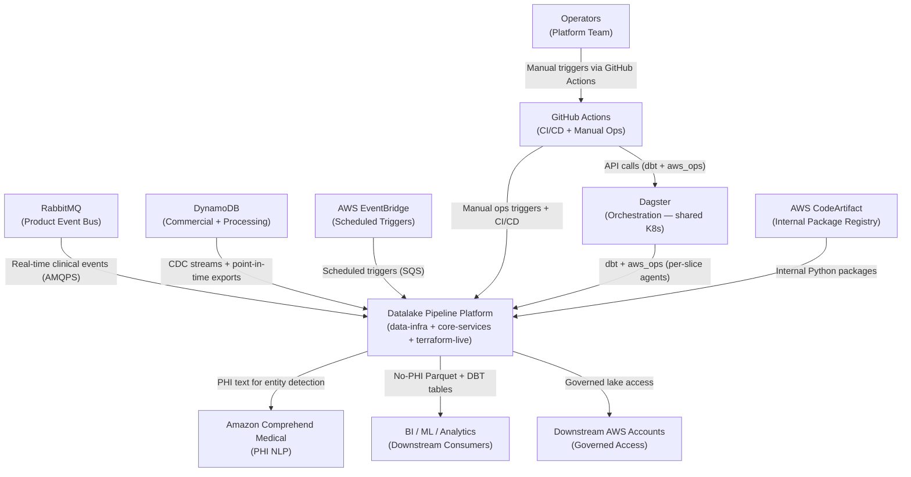

# Context Viewpoint

---
layout: default
---

## System Scope

### ✅ In Scope

- Real-time event ingestion from RabbitMQ
- PHI de-identification (structured + free-text)
- JSON → Parquet conversion for analytics
- DBT analytical modeling (Athena / Iceberg)
- DynamoDB table replication into the lake
- Manual operator triggers for ad-hoc ops

### ❌ Out of Scope

- Upstream RabbitMQ platform (external)
- Clinical application layer
- BI / ML tooling (Redash, Tableau)
- Commercial DynamoDB source tables
- Query interface for consumers

 

> **Three repositories, one platform:** `core-services` (DESA) · `data-infra` (5 pipeline services + DBT) · `terraform-live` (AWS infrastructure)

---
layout: default
---

## Context Diagram

<Transform :scale="0.72">

</Transform>

---
layout: default
class: text-sm
---

## External Dependencies

| Dependency | Role | Criticality | Fallback |
|-----------|------|-------------|---------|
| **RabbitMQ** | Source of all real-time clinical events | 🔴 CRITICAL | Messages queue in RabbitMQ; DESA resumes on recovery |
| **AWS SQS** | Inter-service coordination | 🔴 CRITICAL | Managed service; messages persist through failures |
| **Amazon Comprehend Medical** | Free-text PHI detection (TEDI) | 🟠 HIGH | Cross-region fallback (Frankfurt → eu-west-1) |
| **AWS Kinesis Firehose** | Batch delivery to S3 | 🟠 HIGH | Built-in retry; extended outage → event loss |
| **AWS Athena / Glue** | SQL engine for DBT + DDB replication | 🟠 HIGH | No in-platform fallback; processing pauses |
| **Dagster** | dbt + aws_ops orchestration | 🟠 HIGH | EventBridge → SQS → DRT fallback (disabled, not deleted) |
| **AWS EventBridge** | Scheduled triggers (data swamp + DDB CDC) | 🟡 MEDIUM | Manual GitHub Actions trigger available |
| **AWS CodeArtifact** | Internal Python packages | 🟡 MEDIUM | Service builds fail; no runtime impact |
