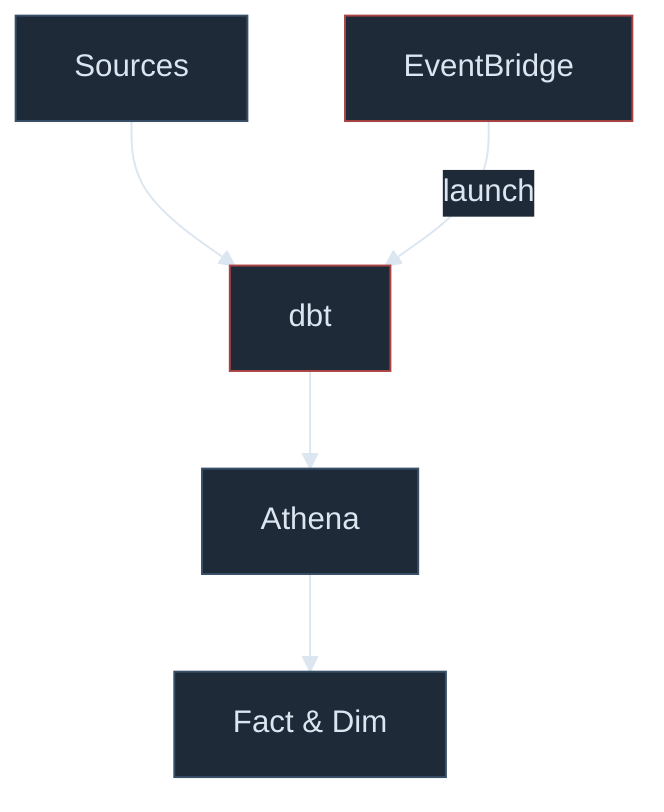
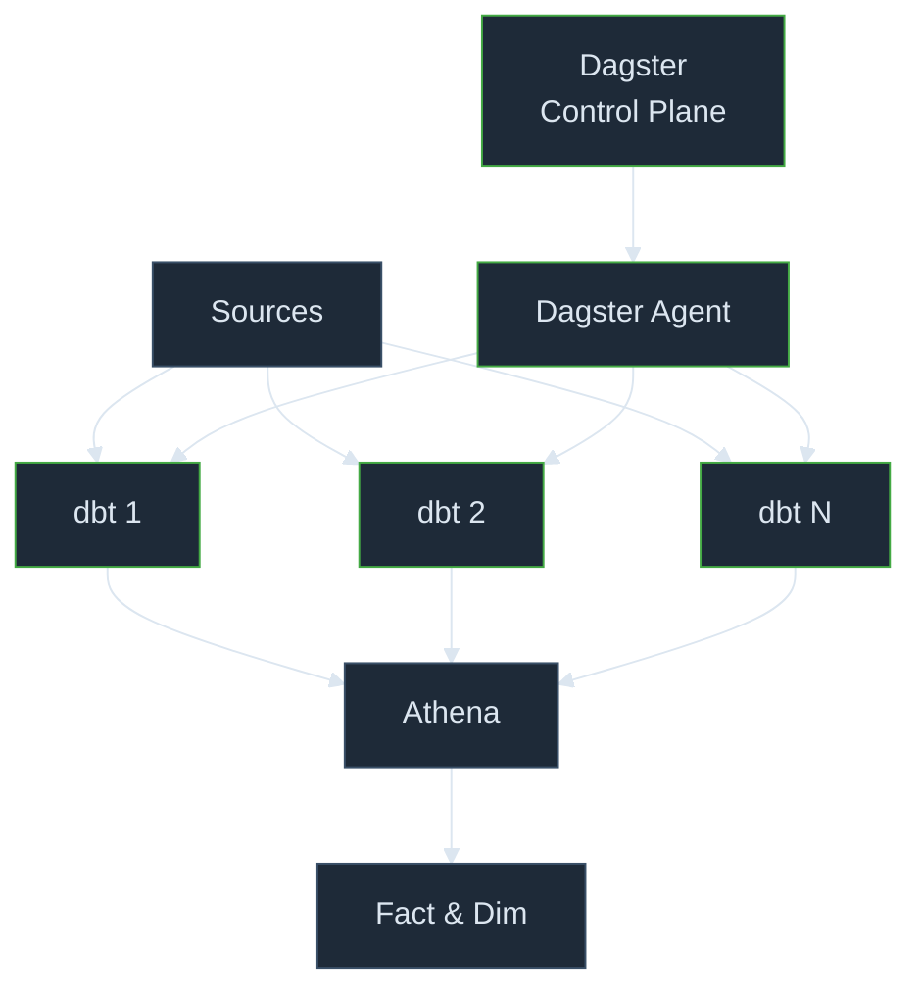

# Development Viewpoint

---
layout: default
class: text-sm
---

## Functional → Platform

| **Functional concept** | **Runtime** |
| ------------------ | ------- |
| Pipeline microservices (DESA, DET, TEDI, …) | Python on EKS |
| Service handoff | SQS — message body or S3 path for large payloads |
| CDC replication (Postgres) | DMS |
| CDC replication (DynamoDB) | Kinesis Data Streams → Firehose |
| Entity materialization | Python microservice (EKS · SQS) |
| Data transformation | dbt on Athena |
| Scheduler (current) | EventBridge |
| Scheduler (target) | Dagster — control plane + agent |
| Lake permissions | IAM · Lake Formation |

---
layout: default
class: text-sm
---

## Transformation — Current vs Target

**Current**

**Target**

---
layout: default
class: text-sm
---

## Repositories

* **`data-infra`**
  * Services + dbt + Dagster code location
  * Each service has its own `pyproject.toml` and `Dockerfile`
  * GitHub Actions are used as ops tools (e.g. `trigger_ddb_replicator`)

* **`terraform-live`**
  * Centralized Infrastructure as Code (IaC)
  * One folder per env slice
  * Use internal terraform-modules for reuse
