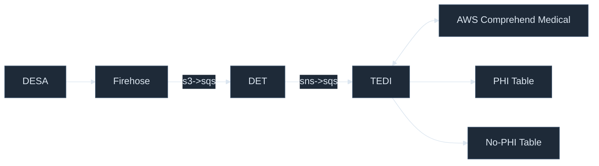
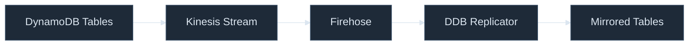
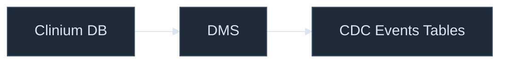
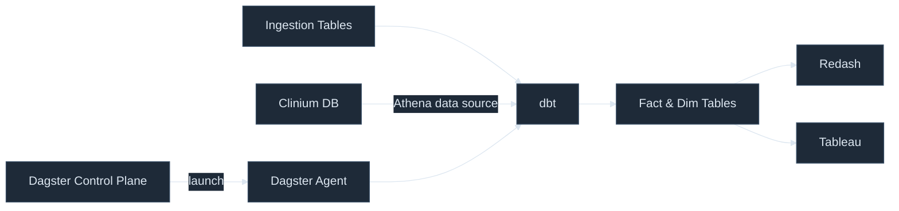

# Functional Viewpoint

---
layout: default
---

## Backend Event Ingestion

* DESA - Listen to RabbitMQ.
* DET - Events Transformation (normalizes different versions).
* TEDI - Text De-identification.

---
layout: default
---

## CDC Ingestion

**DynamoDB CDC**

**Clinium CDC**

* Kinesis Stream, Firehose, and DMS are AWS services.
* Clinium DB — RDS (Postgres), the main operational database.

---
layout: default
---

## Transformation

* Dagster Control Plane is cross-region and cross-environment.
* Dagster Agent is per environment.
* All transformations are done through Athena.
* Permissions are managed by IAM + Lake Formation.

