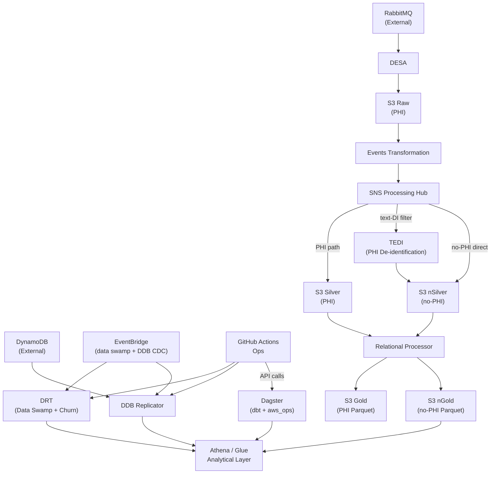

# Functional Viewpoint

---
layout: default
class: text-sm
---

## Functional Elements

| Element | Repo | Responsibility |
|---------|------|---------------|
| **DESA** | `core-services` | Consume RabbitMQ events; envelope & deliver to raw S3 via Firehose |
| **Events Transformation** | `data-infra` | Normalize v1/v2 schemas to `GenericEvent`; publish to SNS |
| **SNS Routing Layer** | Infrastructure | Fan-out transformed events via message attribute filters |
| **TEDI** | `data-infra` | Hash structured PHI; NLP-mask free-text PHI via Comprehend Medical |
| **Relational Processor** | `data-infra` | Convert JSON events to Parquet; group by partition dimensions |
| **DRT** | `data-infra` | Run Data Swamp SQL; data retention churn |
| **Dagster** | `data-infra` | Schedule & execute dbt builds and aws_ops across all 5 slices |
| **DDB Replicator** | `data-infra` | Merge DynamoDB CDC + full-load exports into Glue/Iceberg via Athena MERGE |

---
layout: default
---

## Pipeline Flow

<Transform :scale="0.68">

</Transform>
