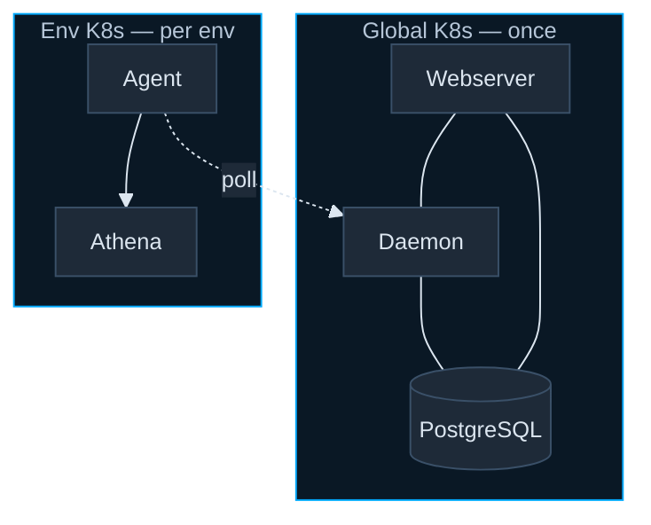
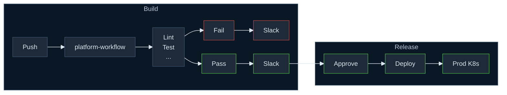

# Deployment Viewpoint

---
layout: default
class: dagster-topology
---

## Dagster Topology

* Agents run with pipeline services using outbound-only polling

---
layout: default
class: text-sm
---

## Deployment Flow

* platform-workflow is the central CI/CD hub for all repos

* It enforces cross-repo quality gates via automated jobs

* Workflows integrate with Slack for visibility and control

