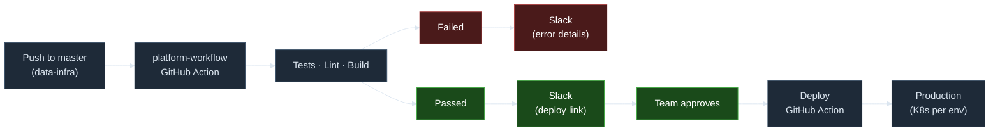
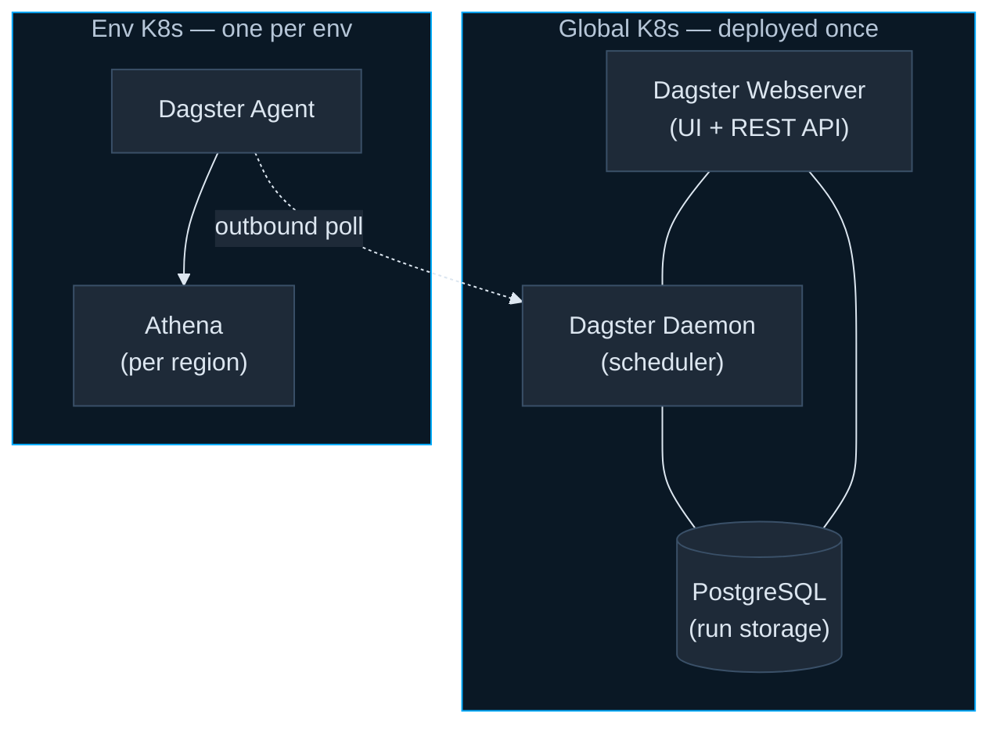

# Deployment Viewpoint

---
layout: default
---

## Deployment Flow

---
layout: default
---

## Dagster Topology

<Transform :scale="0.75">

- Agents run with pipeline services using outbound-only polling

</Transform>
