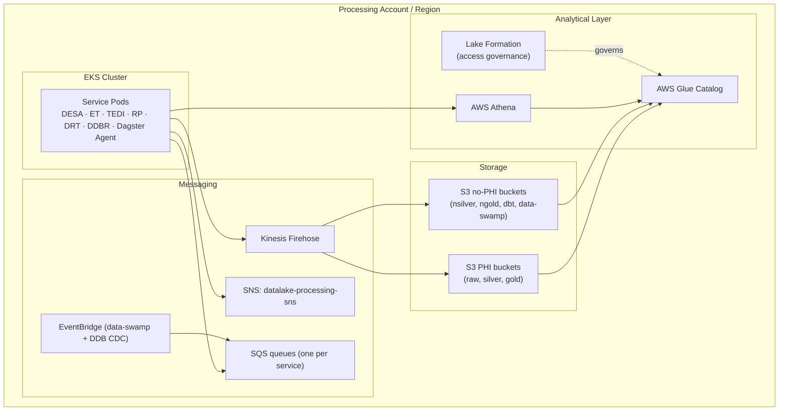
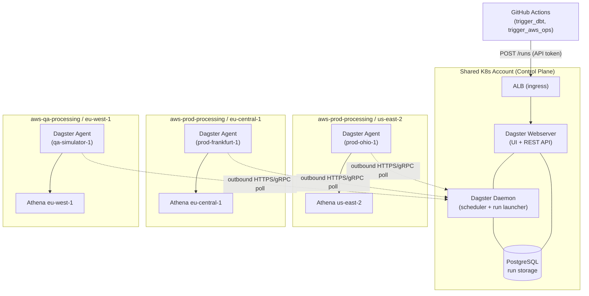

# Deployment Viewpoint

---
layout: default
---

## AWS Account Topology & Environment Slices

### AWS Accounts

| Account Band | Role |
|-------------|------|
| `aws-prod-processing` | Production pipeline runtime |
| `aws-qa-processing` | QA pipeline runtime; isolated from prod |
| `aws-prod-commercial` | Commercial DynamoDB source tables |
| `aws-master` / `aws-mgmt` | Organization management, SSO |

### Environment Slices

| Slice | Account | Region | Type |
|-------|---------|--------|------|
| `prod-ohio-1` | aws-prod-processing | us-east-2 | Production |
| `prod-upmc-1` | aws-prod-processing | us-east-2 | Production |
| `prod-frankfurt-1` | aws-prod-processing | eu-central-1 | Production (EU) |
| `qa-simulator-1` | aws-qa-processing | eu-west-1 | QA (primary) |
| `qa-solaris-1` | aws-qa-processing | eu-west-1 | QA (secondary) |

---
layout: default
---

## Infrastructure per Slice

<Transform :scale="0.72">

</Transform>

---
layout: default
---

## Dagster Cross-Slice Topology

<Transform :scale="0.62">

</Transform>

> Agents in processing accounts poll the control plane **outbound** — no inbound connections, no VPC peering required.
